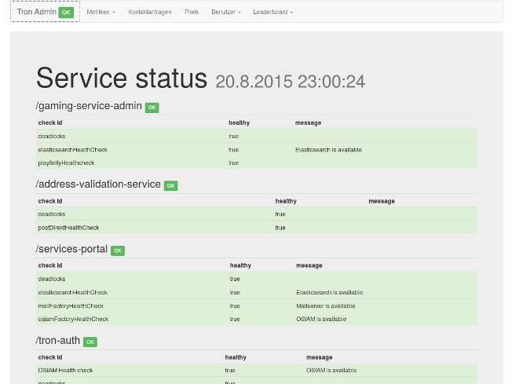

Warum Container
=================
* Trend zu Micro Services
* Einfaches und schnelles Deployen
* Klar definierte Deployment-Schnittstelle

Immutable Infrastructure
-------------------------
* Alles Services und Systeme werden in einem definierten Build-Prozess gebaut
* Daten und Dienste werden klar getrennt
* Ein Service wird nur gestartet und durch einen neuen ersetzt -> niemals verändert
* Warum? __Vermeidung von unterschieden zwischen Entwicklung, Staging und Produktion__

Unterstützung der Entwicklung
===============================

Microservices stellen nicht nur Ops vor Herausforderungen:

- Entwickler müssen die Plattform in einer bestimmten Version lokal zum Laufen bringen
- Die lokale Installation sollte der auf Produktion möglichst ähnlich sein
- Lokal muss es möglich sein Services einfach gegen Entwicklungsversionen auszutauschen

Voraussetzungen für Docker
===============================

DevOps:
----------

- Durchgehende Build-, Test- und Deployment-Automatisierung
- Gelebtes DevOps: “You Build It, You Run It”

Warum ist das so wichtig?
----------------------------

Es muss möglich sein auch für kleine Änderungen die komplette Build-Pipeline zu durchlaufen

Immer Docker?
====================

Wann ich kein Docker einsetzen würde:

- Wenn Software-Entwicklung und Betrieb getrennt sind

- Wenn keine aktive Entwicklung der Plattform geplant ist: Einmal entwickelt und nie wieder angepackt.

Buzzerdeal.de
=================

Casual Gaming Plattform der Deutschen Post 

Herausforderungen
=================

Schnelle Entwicklung (Erstes Release nach ca. 8 Wochen)

Agile inkrementelle Weiterentwicklung

Entwicklung und Betrieb aus einer Hand

Hohe Sicherheitsvorgaben (Deutsche Post)

- Sicherheitskonzept
- Code- und Architektur-Audit
- Pen Testing
- Nachvollziebarer Erstellungsprozess

Hohe Qualitätsansprüche:

- Automatisierte Tests (Unit, Komponenten, UI)
- Staging-Umgebungen:

  Lokal -> Dev -> Test -> Referenz -> Produktion

Herausforderungen
====================

Technologieauswahl:
-------------------
Nutzung bestehender Komponenten in unterschiedlichen Technologien.

- Benutzerverwaltung: OSIAM (Java/tomcat)
- Scoring: Playfinity (NodeJS)
- Tracking: Piwik (PHP)
- Neue Komponenten (Java/dropwizard)

Deployment:
------------
- Docker: __Ja__
- Zusätzliche Komplexität: __Nein!__

Das einfachste Tool, das die Anforderungen unterstützt ohne zusätzliche komplexität hinzu zu bringen.

Buzzerdeal.de
=================

Architektur
--------------

TODO!!

gig
=================

Architektur und Routing
=======================
* Portvergabe (Nutzung des docker interfaces als localhost)
* Nginx als Router

Konfiguration unterschiedlicher Environments
=================

Lokale Entwicklung
====================
* Ersetzen von Containern gegen lokal gestartete Dienste

Base images selber bauen
====================
Warum eigene Images?
- Kontrolle von Upstream Änderungen
- Aufbau der eigenen Images auf wenige Base-Images
- Security: Vertauen ist gut - eigene Images sind besser!

TODO: Image Hierarchie Buzzerdeal

Versionierung
=================
- Wie kann ich den Source-Code-Stand eines Containers finden?
- Auf welche Images baut mein Image auf?
- Wie kann vermeiden, dass sich zu viele Image-Versionen ansammeln?

Way to go:
-----------
- Builds überschreiben immer den Stand `latest` -> Das spart Plattenplatz!
- Keine Unterscheidung zwischen CI-Builds und Release-Builds.
- Eine Version, die ausgerollt werden soll bekommt nach erfolgreichem Test ein Tag.
- Branches vermeiden (Lieber schnell vorwärts rollen und toggeln).

Versionierung - Version Files
=============================
Jeder Build legt eine Textdatei: `<imagename>.version` im Image ab:

 - Imagename
 - Build Datum
 - Git commit id
 - Jenkins build id

Mit `gig versions` werden alle Version-Files eines Images ausgegeben:

    "gig_nginxBackend": {
      "image": "tron-registry.lan.tarent.de/nginx-backend:latest",
      "imageHash": "de1ddbe6b6d1",
      "versionFiles": [
        "nginx-backend,2015-05-13:09:09:43,commit d7..23,jenkins-nginx_backend-150",
        "nginx,2015-05-13:09:08:49,commit c2..70,jenkins-nginx_baseimage-71",
        "ubuntu-baseimage,2015-05-12:23:00:48,commit d3..5a,jenkins-ubuntu_baseimage-58"
      ]},

Logging & Monitoring
======================
* Log Stacks
* Logspout
* Cadvisor

Health-Checks
==============
Jeder Service hat http-Entpunkte `/health` und `/metrics`

Abfrage und anzeige in einem Dashboard:

Learnings:
=================
* Container müssen unabhängig deploybar sein

Backup Slides
================

Sichheit
=================
Wie sicher ist Docker?
* Auf jeden Fall sicherer als ohne Docker
* Klare Definition von Kommunikationskanälen
