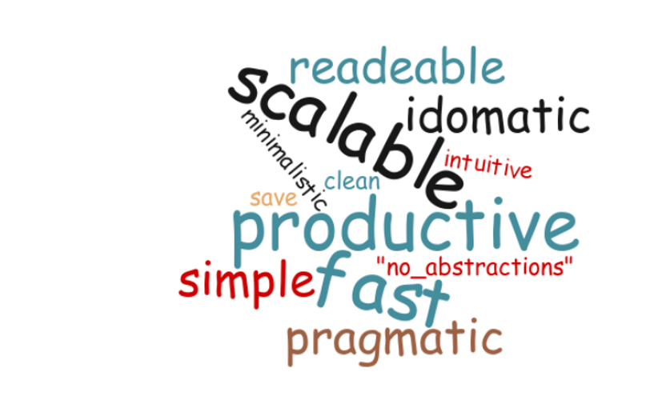

Überblick
=================

* Relativ neue Programmiersprache
 * go 1.0 in 2012
 * aktuell: go 1.7

* BSD License
* Erfunden und maintained von google
* Statisches Typsystem
* Garbage Collector
* Statisch gelinkte binaries

Haupt Einsatzzwecke
===================

* Server side programming
* Datenverarbeitung
* HTTP Server und Reverse-Proxies
* Microservices

Projekte in Go
--------------
* Docker
* Drone
* etcd
* Kubernetes
* consul
* Prometheus
* InfluxDB

Warum ich go verwende? 
======================
Go hat mir den Spaß am Programmieren zurück gebracht!

* Es versucht nicht schön zu sein, sondern: einfach und gut.

* Um komplizierte Probleme zu lösen brauche ich Werkzeuge, die einfach zu beherschen sind.

* Auch nach 3 Wochen Urlaub kann ich mich noch erinnern wie es funktioniert.

Charakter
=================

Syntax
=================
* Angelehnt an gewohnte C-Syntax, aber mit Vereinfachungen
* Sparsam: Keine Klammern, kein `;`
* Public Bezeichner werden groß geschrieben
* Typ Inferenz `:=` initialisiert und deklariert eine Variable
* Mächtiger `for` loop für alle Schleifentypen
* `if` mit Initialisierung
* Funktionen mit mehreren Rückgabewerten

Typsystem
=================
* (Sehr) streng typisiert
* Build in: Primitive, Maps und Slices
* Interfaces

Aliastypen
------------

    type Point [2]int

Structs
-----------

    type User struct {
	    UserName  string     `json:"userName"`
	    NickName  string     `json:"nickName"`
    }
    
    user := User{UserName: "Ben", NickName: "Utzer"}

Syntax Beispiel
=================

    package main

    import (
	    "regexp"
    )

    func main() {
	    terms := []string{"java", "is", "fun"}
	    for _, value := range terms {
	        rx := regexp.MustCompile("java")
	        value = rx.ReplaceAllString(value, "golang")
	        println(value)
	    }
    }

->
    
    $ go run examples/syntax_example.go 
    golang
    is
    fun

Http Server Beispiel
====================

    package main
    
    import (
	    "net/http"
	    "os"
    )
    
    func main() {
        listen := "127.0.0.1:1234"
	    if len(os.Args) > 1 {
	        listen = os.Args[1]
	    }
    
        handler := http.FileServer(http.Dir("./"))
    
	    panic(http.ListenAndServe(listen, handler))
    }

Tooling
===================
Go hat einen super schnellen Compiler und
umfangreiches tooling direkt integriert:

* `go vet` - Statische Fehleranalyse
* `go fmt` - Einheitliche Code Formatierung
* `go doc` - Doku Generator/Browser
* `go generate` - Source Code Generierung
* `go test` - Test und Benchmark Runner mit Testcoverage report
  
go get
=========================
Go's dependency Konzept

* Source Code Dependencies
* Kein library-Konzept
* Automatischer Download und Build über `go get package/name`

Beispiel:

    export GOPATH=`pwd`
    go get github.com/smancke/servelocal

Imports sind Referenzen auf Code Repositories:

    import "github.com/gorilla/handlers"

Testing
===================
* Alle Dateien mit der Endung `_test.go` beinhalten testcode
* `go test <package>`
* Tests sind Funktionen mit der Signatur: `func Test_*(t *testing.T)`

Beispiel:

    package foo
    
    import "testing"

    func Test_Simple(t *testing.T) {
    
        t.Logf("This Test fails")
	    t.Fail()
    
    }

OO in golang
=================
Go erzwingt keine objekt orintierte Programmierung aber unterstützt diese aber:

Typen können Mehtoden haben.

    type Point [2]int

    type Item struct {
        Name string
        Pos  Point
    }
    
    func (item *Item) MoveTo(vector Point) {
        item.Pos = item.Pos.Add(vector)
    }

    func (item *Item) String() string {
	    return fmt.Sprinf("%v (%v,%v)", item.Name, item.Pos[0], item.Pos[1])
    }

Es gibt keine Vererbung, aber Interfaces und Embedding mit Delegation.

Interfaces
=============
* Interfaces folgen dem Duck-Typing Ansatz: Was aussieht wie eine Ente, ist auch eine Ente!
* Der Consumer legt das Interface fest, nicht der implementierer.

Vorteil
--------
* Enkoppelung von Consumer und Provider
* Kleinere Interfaces
* Kompatibilität auf Basis der Signatur, nicht des Typnamens

Interface Example
==================

    type myInt int
    
    func (i myInt) String() string {
	    return strconv.Itoa(int(i))
    }
    
    type Printable interface {
	    String() string
    }
    
    func Test_Stringer(t *testing.T) {
	    printable := []Printable{
	        &Item{Name: "Something"},
	        myInt(42),
	        os.ModeAppend | os.ModeSocket,
	    }
    
	    for _, p := range printable {
	        fmt.Println(p.String())
	    }
    }

First Order Functions
======================
Go unterstützt Funktionen auf erster Ebene:

    f := func(message string) {
		println(message)
	}
    
	f("hello froscon")

Auch Funktionen sind typisiert, z.B.:

    type F func(string)

*Aber:* Durch strenge Typisierung und fehlende Generics sind funktionale Elemente wie map/reduce leider schlecht umsetzbar.

defer
=============================
* Verzögert die Ausführung bis an das Ende der aktuellen Funktion
* Die Ausführung wird garantiert (vgl. finally{} in Java)

Beispiel:

    import "os"

    func main() {
	    file, err := os.Create("/tmp/hello")
	    if err != nil {
		    fmt.Printf("error: %v", err)
		    return
        }
	    defer file.Close()
        
	    file.WriteString("Hello World\n")
    }

Fehlerbehandlung
=================
Fehlerhandling läuft meist über die Rückgabe von `error`-Werten

    if value, err := machEtwas(); err != nil {
        // handle error
    } else {
        // use value
    }

Es gibt aber auch ein Equivalent zu Exceptions:

    func travel() {
	    defer func() {
	        if r := recover(); r != nil {
                fmt.Println(r, "dont't panic!", )
            }
	    }()
	    panic("I lost my towel")
    }

Goroutinen
==============
Goroutinen sind eine leichtgewichtige Alternative zu Theads.
Sie werden von der Go Runtime auf echte Threads verteilt.

Test auf *i7-6600U*:

__1 Mio Goroutinen lassen sich in 1,3 Sekunden ausführen.__

(Vgl.: 1 Mio Java Threads: ~30 Sekunden)

##  Syntax

    go doInBackground()

Oder inline definiert:

    go func() {
	    for i := 0; i < 100; i++ {
		    fmt.Println("in background inline")
	    }
    }()
    
Channel
========

*Do not communicate by sharing memory; instead, share memory by communicating.*

* Ein Channel ist eine typisierte fifo-Queue mit fester Länge
* Der Channel kann Daten beliebigen Typs aufnehmen
* Alle Operationen auf Channel sind robust gegenüber paralleler Zugriffe

Erstellen eines Channels: `make (chan DataType, size)`

Schreiben in den Channel: `ch <- value`

Lesen vom Channel: `value <- ch`

* Operationen auf einen Channel blockieren
* Channel können gepuffert oder ungepuffert sein

Channel Beispiele
===============================

Asynchron Schreiben
--------------------

    ch := make(chan string)
    
    go func() {
	    ch <- "The Answer is "
	    ch <- "42"
    }()

    fmt.Println(<-ch)
    fmt.Println(<-ch)

Timer
-------------------

    timeoutChannel := time.After(time.Second)
    <-timeoutChannel
    fmt.Println("One second is elapsed")

Buffered Channel
===================
Ein channel kann eine Buffer-Size besitzen.
Schreiben blockiert nicht, solange der Channel noch Platz hat.

Beispiel:
----------

    ch := make(chan string, 2)
    
    ch <- "The Answer is "
    ch <- "42"
    // ch <- "one more write would block!"

    fmt.Println(<-ch)
    fmt.Println(<-ch)

Select
==========

* Die `select` Anweisung kann verwendet werden um mehrere Channel Operationen in einem durch zu führen.
* Bei mehreren Case-Zweigen wird der Zweig ausgeführt, der als erster verfübar ist.

Beispiel:
----------

    ch := make(chan string, 2)
    ch <- "The Answer is "
	ch <- "42"
        
    for {
        select {
            case msg := <-ch:
	            fmt.Println(msg)
	        default:
	            fmt.Println("no input available.")
	            return
        }
    }

    
Links und Doku
================

Golang Doku: [https://golang.org/doc/](https://golang.org/doc/)

A Tour of Go: [https://tour.golang.org](https://tour.golang.org)

Schulung mit Beispielen:

[https://github.com/smancke/talks/tree/gh-pages/golang\_schulung](https://github.com/smancke/talks/tree/gh-pages/golang_schulung)

Programming in Go:

Danke ...
================

Slides:

[https://smancke.github.com/talks/2016\_froscon\_golang/](https://smancke.github.com/talks/2016\_froscon\_golang/)

Beispiele & Markdown:

[https://github.com/smancke/talks/](https://github.com/smancke/talks/tree/gh-pages/2016_froscon_golang)

